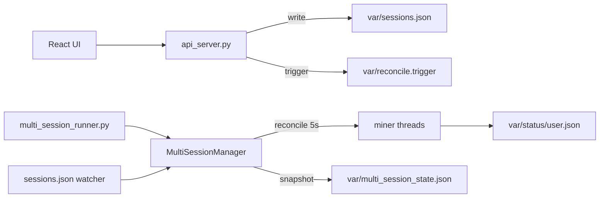

# Twitch Channel Points Miner — Production Dashboard

> **История версий:** [CHANGELOG.md](./CHANGELOG.md) · классический майнер: [README.md](./README.md)

## Architecture (V3.4)

| Layer | Path | Role |
|-------|------|------|
| Python miner | `TwitchChannelPointsMiner/` | Core farming logic |
| Control plane | `TwitchChannelPointsMiner/platform/` | Config, Twitch API, sessions, stats |
| API | `api_server.py` | Flask REST + static UI |
| Accounts | `config/accounts.json` | Per-bot JSON config (no `accounts/*.py`) |
| Factory | `platform/miner_factory.py` | Builds miner from JSON |
| GQL | `platform/gql_queries.py` | **Only** GraphQL entry: `GQLClient` |
| Multi runner | `multi_session_runner.py` | One OS process, many bot threads |
| Desired state | `var/sessions.json` | Atomic read/write via `sessions_io.py` |
| Runtime state | `var/multi_session_state.json` | Heartbeat, errors, worker map |
| Settings | `config/settings.json` | Rate limits, TTL, runner, logs, chat |

## Multi-Session Architecture



1. **Desired state** — `var/sessions.json` lists bots the panel wants running.
2. **Reconciler** (every 5 s + file/trigger) starts/stops threads to match desired.
3. **Retries** — up to 3 restarts per bot with backoff 5 / 15 / 45 s; max 3 parallel starts.
4. **Watchdog** — forces reconcile if the loop stalls; runner restarts up to 3× on crash.
5. **Graceful shutdown** — signals → `miner.end()` → chat/GQL cleanup → final state file.

**Do not use** `screen`, `session_runner.py`, or per-bot `accounts/*.py`.

## Data flow

1. Streamers → `config/streamers.json`
2. Accounts → `config/accounts.json` + `cookies/<user>.pkl`
3. Start → `POST /api/sessions/start` → atomic write `sessions.json` → runner reconcile
4. Status → `var/status/<user>.json` + `multi_session_state.json`
5. Stop → remove from `sessions.json` (reconciler stops thread)

## Run (production)

```bash
cd ui && npm run build && cd ..
./venv/bin/python api_server.py
# runner auto-starts from panel, or:
./venv/bin/python multi_session_runner.py
```

## Migration to V3.4

1. `git pull` + `cd ui && npm run build`
2. Merge `config/settings.json` (see repo default; legacy `rate_limits.json` auto-imported once)
3. Stop old runner: `pkill -f multi_session_runner`
4. Start API + bots from panel
5. `GET /api/health` → `3.4.0`, `GET /api/sessions/debug` → `runner_health: Healthy`

## API (short)

- `GET /api/health` — version `3.4.0`
- `GET /api/system` — `runner_health`, `bot_resources`, multi runner stats
- `GET /api/sessions/debug` — `worker_details`, `error_history`, orphans
- `POST /api/sessions/start|stop|restart` — desired state + single-bot restart on re-auth
- `GET|POST /api/chat` — buffer 150, bulk queue with backpressure
- `POST /api/auth/device/start` — `{ username, force?: true }`

## Troubleshooting

| Symptom | Cause | Fix |
|---------|--------|-----|
| Chat `WRONG_ACCOUNT` | Cookie `persistent` ≠ OAuth token | Чат → «переавторизовать» или Аккаунты → force re-auth |
| Chat `msg_rejected` | Ban / unverified account / rate limit | Wait; verify email/phone; re-auth |
| `runner stopped` in header | No `multi_session_runner` process | Start bots from panel or run runner manually |
| `runner degraded` | Worker errors / stale heartbeat | `GET /api/sessions/debug`; check `logs/sessions/<user>.log` |
| Bot not starting | `missing_cookie` / `missing_json_config` | Cookie via device auth; `restore-config` in UI |
| `max_retries_exceeded` | Repeated miner crash | Read per-bot log; fix config/streamers; remove from desired and re-add |
| GQL `PersistedQueryNotFound` | Stale hash | Auto full-query retry; override in `var/gql_hashes.json` |

Logs:

- `logs/multi_session_runner.log` — manager (rotating 5 MB × 5)
- `logs/sessions/<username>.log` — per-bot

## Notes

- Debug one bot: `python multi_session_runner.py --single USERNAME`
- GQL overrides: `var/gql_hashes.json`
- All tunables: `config/settings.json`
