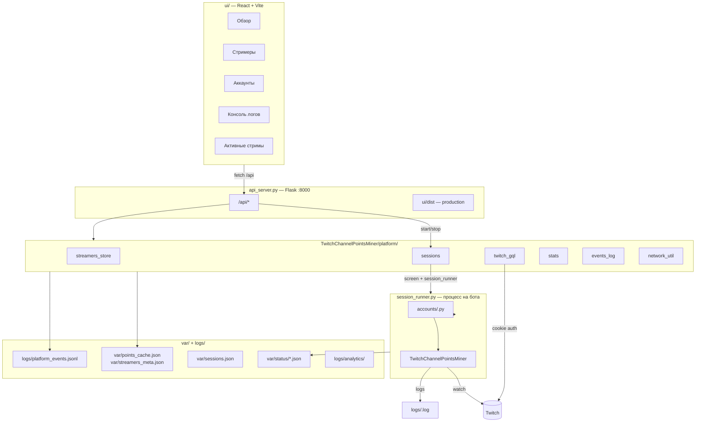

# Twitch Channel Points Miner

> **Production dashboard (V3.4):** см. [FULLSTACK_README.md](./FULLSTACK_README.md) — multi-session, API, миграция, troubleshooting.  
> Запуск ботов: `multi_session_runner.py` + `config/accounts.json` (не screen / `session_runner.py`).

# Twitch Channel Points Miner (classic) — FullStack Dashboard

Полноценная панель управления для автоматического фарма **Channel Points** на Twitch: Python-майнер, REST API на Flask, React-дашборд и control plane `TwitchChannelPointsMiner/platform/`.

> Краткая шпаргалка по запуску также в [FULLSTACK_README.md](./FULLSTACK_README.md).

**Версия API:** `3.4.0` (см. `GET /api/health`)

---

## Содержание

- [О проекте](#о-проекте)
- [Возможности](#возможности)
- [Архитектура](#архитектура)
- [Структура каталогов](#структура-каталогов)
- [Требования и установка](#требования-и-установка)
- [Запуск](#запуск)
- [REST API](#rest-api)
- [Конфигурация](#конфигурация)
- [Вкладки веб-панели](#вкладки-веб-панели)
- [Роли файлов: accounts, session_runner, run.py](#роли-файлов-accounts-session_runner-runpy)
- [Повторяющийся код и техдолг](#повторяющийся-код-и-техдолг)
- [Устранение неполадок](#устранение-неполадок)
- [История изменений (Changelog)](#история-изменений-changelog)
- [Лицензия и upstream](#лицензия-и-upstream)

---

## О проекте

Проект объединяет:

1. **Twitch Channel Points Miner v2** — ядро на Python (`TwitchChannelPointsMiner/`), которое смотрит стримы, собирает баллы, дропы, предикты и т.д.
2. **Control plane** (`TwitchChannelPointsMiner/platform/`) — конфиги, сессии, Twitch GQL, кэши, события.
3. **API-сервер** (`api_server.py`) — Flask REST + раздача собранного UI.
4. **React UI** (`ui/`) — дашборд из проекта `Twitch-Points-UI`, встроенный в этот репозиторий.

Раньше майнер имел встроенный **Flask Analytics UI** (графики в `assets/`). Он **удалён**; управление и статистика — только через новую веб-панель.

---

## Возможности

### Майнер (ядро)

- Автоматический просмотр каналов из глобального списка стримеров
- Сбор channel points, дропов, watch streak, предиктов (настраивается per-account)
- IRC-присутствие в чате, follow raid, community goals
- Сохранение сессии Twitch в `cookies/<username>.pkl` (device login при первом запуске)
- Логи в `logs/<username>.log` (если включено в конфиге аккаунта)

### Панель управления

- **Стримеры** — глобальный список `config/streamers.json` с флагами «Авто-сбор дропов» и «Приоритет»; аватар и online/offline через Twitch GQL
- **Аккаунты (боты)** — создание через форму → генерация `accounts/<username>.py` (поля как в `run.py`)
- **Сессии** — старт/стоп в `screen` (`twitch1`, …) → `venv/bin/python session_runner.py --username …`; конфиг бота только в `accounts/`
- **Обзор** — агрегированная статистика баллов по всем ботам (GQL `ChannelPointsContext`, кэш)
- **Активные стримы** — кто сейчас в эфире и какие боты на канале
- **Консоль логов** — потоковое чтение логов майнера + скачивание файла
- **События платформы** — журнал в `logs/platform_events.jsonl` (старт/стоп, заработок баллов, добавление ботов)
- **Баллы / награды** — модал: стример, боты, список наград; активация с `text` / `textInput` для наград с вводом
- **Чат** — IRC-лента и отправка (`GET/POST /api/chat`), широкое поле ввода
- **Баллы** — вкладка `/points`: активация custom rewards (`POST /api/activate-reward`)
- **Фолов** — кнопка «Фоловнуться» на аккаунтах (`POST /api/follow`, Helix, пропуск уже подписанных)
- **Горячее добавление стримеров** — новый стример в `streamers.json` подхватывается работающими сессиями без рестарта
- **Активные стримы** — по `var/status/*.json` (`is_online`), не по кэшу баллов
- **Система** — CPU/RAM/uptime хоста, число активных сессий
- **Офлайн-режим сети** — при недоступности Twitch панель работает из кэша (`var/streamers_meta.json`, `var/points_cache.json`)

---

## Архитектура



### Поток данных (кратко)

1. Добавление стримера в UI → `POST /api/streamers` → `config/streamers.json`.
2. Создание бота в UI → `POST /api/accounts` → `accounts/<username>.py`.
3. Старт → `POST /api/sessions/start` → `screen -dmS twitchN venv/bin/python session_runner.py --username …` → загрузка `accounts/<user>.py` → `mine(streamers)` из глобального конфига.
4. Каждые ~15 с → `var/status/<username>.json` (баллы, online по каналам).
5. Фоновый поток API → обновление meta/points кэша (если сеть доступна).
6. Dashboard → чтение points cache + sessions + streamers meta.

---

## Структура каталогов

```
Twitch-Channel-Points-Miner-v2/
├── api_server.py              # Flask: REST API + static UI (production)
├── session_runner.py          # Точка входа процесса майнера для одного бота
├── run.py                     # Эталонный шаблон конфига (не production-путь)
├── requirements.txt           # Python-зависимости
├── FULLSTACK_README.md        # Краткая шпаргалка (дублирует раздел «Запуск»)
├── pickle_view.py             # Утилита просмотра .pkl (отладка cookies)
│
├── TwitchChannelPointsMiner/  # Ядро майнера (upstream logic)
│   ├── TwitchChannelPointsMiner.py
│   ├── classes/               # Twitch, WebSocket, Bet, Streamer, Login…
│   ├── constants.py           # GQL operations, CLIENT_ID
│   ├── logger.py
│   └── platform/              # Control plane (сессии, GQL, аккаунты, события)
│       ├── paths.py           # Пути: cookies, logs, config, var…
│       ├── accounts.py        # CRUD аккаунтов, schema для формы
│       ├── account_builder.py # Генерация accounts/*.py из JSON формы
│       ├── streamers_store.py # CRUD streamers.json + meta cache
│       ├── sessions.py        # start/stop screen + session_runner
│       ├── twitch_gql.py      # GQL: live, avatar, points, rewards
│       ├── network_util.py    # Проверка DNS/доступности Twitch
│       ├── stats.py           # dashboard_stats, active_streams
│       ├── logs_util.py       # Чтение логов порциями
│       └── events_log.py      # platform_events.jsonl
│
├── ui/                        # React 19 + Vite 6 + Tailwind 4
│   ├── src/
│   │   ├── api.ts             # Типы и fetchJson
│   │   ├── App.tsx            # Вкладки панели
│   │   └── components/        # Dashboard, Streamers, Accounts, Logs…
│   ├── vite.config.ts         # proxy /api → :8000
│   └── dist/                  # Сборка для production (npm run build)
│
├── config/
│   └── streamers.json         # Глобальный список каналов для всех ботов
│
├── accounts/
│   └── <username>.py          # Единственный конфиг бота (create_miner), генерируется UI
│
├── cookies/
│   └── <username>.pkl         # Сессия Twitch (создаётся при первом логине)
│
├── logs/
│   ├── <username>.log         # Логи майнера
│   ├── platform_events.jsonl  # События панели
│   └── analytics/<user>/      # JSON-аналитика майнера (enable_analytics)
│
├── var/                       # Runtime state панели (бывший runtime/)
│   ├── sessions.json          # PID активных session_runner
│   ├── status/<user>.json     # Снимки статуса майнера
│   ├── status/<user>.stop     # Флаг мягкой остановки с панели
│   ├── streamers_meta.json    # Кэш аватаров / is_live
│   ├── points_cache.json      # Кэш баллов для дашборда
│   └── auth/                  # Device login state
│
└── assets/                    # Статичные картинки README upstream (не web UI)
```

### Что намеренно убрано / не используется

| Удалено / отключено | Причина |
|---------------------|---------|
| `TwitchChannelPointsMiner/classes/AnalyticsServer.py` | Старый веб-frontend аналитики |
| `TwitchChannelPointsMiner.analytics()` | Заменён дашбордом `ui/` |
| `assets/charts.html`, `script.js`, старые CSS графиков | Часть старого UI |
| `ui/server.ts`, `express` | Прокси перенесён в Vite + Flask |
| Список стримеров в `run.py` → `mine([...])` | Единый `config/streamers.json` |
| `run_panel/*.py` (эксперимент) | Удалено: дублировало `accounts/` + `session_runner.py` |
| Корневые `run1.py` … `runN.py` (старый VPS manager) | Заменены на `accounts/*.py` + общий `session_runner.py` |

---

## Роли файлов: accounts, session_runner, run.py

| Файл | Роль | Запускается в screen? |
|------|------|------------------------|
| `accounts/<user>.py` | Настройки майнера: `def create_miner()` → `TwitchChannelPointsMiner(...)` | **Нет** — это модуль-конфиг, не скрипт |
| `session_runner.py` | Общая точка входа: загрузить `accounts/<user>.py`, `mine(streamers_for_miner())`, status → `var/status/` | **Да** — один runner на всех ботов, различие по `--username` |
| `run.py` | Справочный шаблон всех опций (как в upstream) | Только вручную для отладки |
| `device_auth_runner.py` | Разовый device login → `cookies/<user>.pkl` | По запросу API, не майнинг |

**Почему не как старый `manager.py` с `run1.py`?**  
Раньше на VPS каждый бот был отдельным файлом `runN.py` с `username = "..."` и вызовом `mine()` внизу файла. В FullStack конфиг вынесен в `accounts/`, а исполняемая логика — в одном `session_runner.py` (статус для панели, stop-флаг, platform events). В screen уходит та же схема, что в manager:

```bash
screen -dmS twitch1 ./venv/bin/python session_runner.py --username morguioe
```

Дополнительные копии `run_panel/<user>.py` **не нужны** — они только проксировали вызов `session_runner` и дублировали ответственность папки `accounts/`.

---

## Повторяющийся код и техдолг

Ниже — места, где одна и та же логика или разметка живёт в нескольких файлах. Это не всегда баг, но при рефакторинге стоит знать.

### 1. Конфиг майнера (самое заметное)

| Место | Содержимое |
|-------|------------|
| `run.py` | Полный пример `TwitchChannelPointsMiner` + `StreamerSettings` + `mine()` |
| `platform/account_builder.py` → `ACCOUNT_TEMPLATE` | Тот же каркас для генерации |
| `accounts/*.py` | Сгенерированные копии под каждого бота |

**Итог:** один и тот же блок импортов и настроек в трёх формах. Источник правды для UI — `account_builder.py`; `run.py` — документация; `accounts/*` — данные. Ручные правки в `accounts/` расходятся с шаблоном.

**Возможное упрощение:** один JSON/YAML конфиг на бота + один фабричный модуль без генерации `.py`.

### 2. Старый VPS layout vs FullStack

| Legacy (`manager.py`) | FullStack |
|----------------------|-----------|
| `run1.py` … `run14.py` в корне | `accounts/<user>.py` |
| `mine()` в конце каждого `runN.py` | `session_runner.py` вызывает `mine()` один раз для всех |
| screen `miner{N}` | screen `twitch{N}` |

Это **смена схемы**, а не дубликат в репозитории — если на диске ещё лежат `run1.py`, их можно удалить после миграции на `accounts/`.

### 3. Документация

| Файл | Пересечение |
|------|-------------|
| `README.md` | Полное описание |
| `FULLSTACK_README.md` | Краткий runbook (запуск, API) |

Держать синхронными при изменении API/запуска.

### 4. Два React-дерева (если есть соседняя папка)

| Путь | Статус |
|------|--------|
| `ui/` | Production (собирается в `ui/dist`) |
| `../Twitch-Points-UI/` | Старый отдельный клон UI; **не используется** при `api_server.py` |

При правках фронта менять только `ui/`.

### 5. Точки входа Python с `--username`

| Скрипт | Назначение |
|--------|------------|
| `session_runner.py` | Майнинг + status loop |
| `device_auth_runner.py` | Только cookies |

Общий паттерн argparse; объединять в один CLI не обязательно.

### 6. GQL и Twitch-клиент

| Слой | Когда используется |
|------|-------------------|
| `TwitchChannelPointsMiner/classes/Twitch.py` | В процессе майнера (watch, ставки, …) |
| `platform/twitch_gql.py` | Панель: аватары, live, баллы, награды, redeem |

Два пути к Twitch API — осознанное разделение (панель без запущенного майнера). Частично дублируют `GQLOperations` из `constants.py`.

### 7. Тонкие обёртки API

| Модуль | Над чем |
|--------|---------|
| `platform/rewards.py` | `twitch_gql.redeem_channel_reward` + лог событий |
| `api_server.py` | Вызывает `TwitchChannelPointsMiner.platform.*` |

Нормальный слой, не требует срочного слияния.

### 8. Что уже убрано

- `run_panel/<user>.py` — лишняя прослойка между screen и `session_runner` (удалено).

---

## Требования и установка

### Системные

- **Python 3.10+** (проверено на 3.14)
- **Node.js 18+** и **npm** — только для разработки UI или пересборки `ui/dist`
- Windows / Linux / macOS
- Стабильный доступ к `*.twitch.tv` (DNS + HTTPS). Без сети майнер не сможет смотреть стримы; панель покажет кэш.

### Python

```bash
cd Twitch-Channel-Points-Miner-v2
py -m pip install -r requirements.txt
```

Основные пакеты: `flask`, `requests`, `websocket-client`, `psutil`, `pillow`, `colorama`, …

### Frontend (для dev или пересборки)

```bash
cd ui
npm install
```

Переменные (опционально):

| Переменная | Назначение |
|------------|------------|
| `HOST` | Хост Flask (по умолчанию `0.0.0.0`) |
| `PORT` | Порт API (по умолчанию `8000`) |
| `VITE_BACKEND_URL` | URL бэкенда для Vite proxy (dev) |

---

## Запуск

### Режим разработки (2 процесса)

**Терминал 1 — API и майнер-процессы:**

```bash
py api_server.py
```

**Терминал 2 — UI с hot reload:**

```bash
cd ui
npm run dev
```

Откройте **http://localhost:3000** — запросы `/api/*` проксируются на **http://127.0.0.1:8000** (`ui/vite.config.ts`).

### Production (один процесс)

```bash
cd ui
npm run build
cd ..
py api_server.py
```

Откройте **http://localhost:8000** — Flask отдаёт `ui/dist` и API.

### Первый запуск бота

1. В панели: **Аккаунты** → добавить бота (создаётся `accounts/<login>.py`).
2. **Старт сессии** → в консоли/окне процесса майнера откроется **device login** Twitch.
3. После успешного входа появится `cookies/<login>.pkl`.
4. Добавьте стримеров в **Стримеры** (или отредактируйте `config/streamers.json`).
5. Снова запустите сессию — майнер начнёт смотреть каналы из глобального списка.

### Ручной запуск майнера (отладка)

```bash
py session_runner.py --username YOUR_LOGIN
```

Требуются `accounts/YOUR_LOGIN.py` и непустой `config/streamers.json`.

На VPS (как `manager.py`):

```bash
screen -dmS twitch1 ./venv/bin/python session_runner.py --username YOUR_LOGIN
```

### Шаблон `run.py`

`run.py` — **справочный** файл с полным набором настроек `TwitchChannelPointsMiner`. В production используйте UI → `accounts/*.py`, а не правку `run.py` напрямую.

---

## REST API

Базовый URL: `http://127.0.0.1:8000` (или ваш `HOST:PORT`).

### Система

| Метод | Путь | Описание |
|-------|------|----------|
| `GET` | `/api/health` | `{ status, version, twitch_online }` |
| `GET` | `/api/system` | CPU, RAM, uptime, `active_sessions` |

### Дашборд и стримы

| Метод | Путь | Описание |
|-------|------|----------|
| `GET` | `/api/dashboard` | Сводная статистика баллов; `?refresh=1` — форс обновление |
| `GET` | `/api/active-streams` | Live-каналы и привязанные боты |

### Стримеры

| Метод | Путь | Тело / примечания |
|-------|------|-------------------|
| `GET` | `/api/streamers` | Список; `?refresh=1` — фоновое обновление meta; при ошибке GQL — `degraded: true` + данные без enrich |
| `POST` | `/api/streamers` | `{ "login", "claim_drops?", "high_priority?" }` |
| `DELETE` | `/api/streamers/<login>` | Удаление из конфига |

### Аккаунты

| Метод | Путь | Описание |
|-------|------|----------|
| `GET` | `/api/accounts/schema` | Поля формы создания бота |
| `GET` | `/api/accounts` | Список ботов + cookie + PID сессии |
| `POST` | `/api/accounts` | Создание `accounts/<username>.py` |
| `DELETE` | `/api/accounts/<username>` | Удаление конфига (cookie по желанию вручную) |

### Сессии

| Метод | Путь | Тело |
|-------|------|------|
| `GET` | `/api/sessions` | Активные PID |
| `POST` | `/api/sessions/start` | `{ "accounts": ["user1", "user2"] }` |
| `POST` | `/api/sessions/stop` | `{ "accounts": ["user1"] }` — stop-флаг + `taskkill` на Windows |

Стримеры для `mine()` **не передаются** в start — всегда берутся из `config/streamers.json`.

### Логи и события

| Метод | Путь | Описание |
|-------|------|----------|
| `GET` | `/api/logs?username=&offset=` | Порция текста лога |
| `GET` | `/api/logs/download?username=` | Скачать `.log` |
| `GET` | `/api/events?category=` | Лента `platform_events.jsonl` |

### Награды

| Метод | Путь | Описание |
|-------|------|----------|
| `GET` | `/api/rewards?streamer=&account=` | Список custom rewards канала (GQL) |
| `POST` | `/api/activate-reward` | `{ streamer, rewardId, session?, text?, textInput? }` — GQL redeem; для наград с вводом передайте `text` или `textInput` |
| `GET` | `/api/chat?streamer=&limit=` | Сообщения IRC-чата канала (буфер панели) |
| `POST` | `/api/chat` | `{ streamer, text, session? }` — отправить в чат (один бот или «Все сессии») |
| `POST` | `/api/follow` | `{ login, session? }` — подписаться на канал (Helix); уже подписанные — skip |

### Статика

| Метод | Путь | Описание |
|-------|------|----------|
| `GET` | `/` | `ui/dist/index.html` если собран |
| `GET` | `/<path>` | SPA fallback |

---

## Конфигурация

### `config/streamers.json`

Глобальный список каналов для **всех** ботов:

```json
{
  "streamers": [
    {
      "login": "channel_name",
      "claim_drops": true,
      "high_priority": false
    }
  ]
}
```

| Поле | Значение |
|------|----------|
| `login` | Логин канала (нижний регистр) |
| `claim_drops` | «Авто-сбор» дропов на канале |
| `high_priority` | «Приоритет» — канал выше в порядке сортировки майнера |

### `accounts/<username>.py`

Генерируется из формы UI. Обязательная функция:

```python
def create_miner():
    ...
    return twitch_miner
```

Параметры соответствуют `TwitchChannelPointsMiner(...)` и `StreamerSettings` из `run.py`. Список стримеров в `mine()` **не задаётся** — используется `streamers_for_miner()` из `TwitchChannelPointsMiner.platform`.

### Cookies

- Путь: `cookies/<username>.pkl`
- Формат: pickle-сессия майнера
- Создание: первый логин через device flow в процессе `session_runner`
- Просмотр: `py pickle_view.py` (утилита в корне)

**Не коммитьте** `cookies/` и `logs/` в публичный репозиторий.

### Логи майнера

Включаются в конфиге аккаунта (`logger_settings.save`). Путь: `logs/<username>.log`.

### Runtime-кэши (`var/`)

| Файл | TTL (онлайн) | Назначение |
|------|----------------|------------|
| `var/streamers_meta.json` | ~45 с | display_name, avatar_url, is_live |
| `var/points_cache.json` | ~30 с | баллы для дашборда |
| Офлайн TTL | до 7 дней | отдача последних известных данных без Twitch |

---

## Вкладки веб-панели

| Вкладка | Компонент | Данные |
|---------|-----------|--------|
| Обзор | `DashboardContent` | `/api/dashboard`, `/api/events` |
| Стримеры | `StreamersView` | `/api/streamers` |
| Активные стримы | `ActiveStreamsView` | `/api/active-streams` |
| Аккаунты | `AccountsView` | `/api/accounts`, sessions start/stop |
| Чат | `ChatView` | `/api/chat` — IRC-лента и отправка (стример + сессия / все) |
| Консоль логов | `LogsView` | `/api/logs` |
| Баллы | `PointsView` | `/api/rewards`, `POST /api/activate-reward` |
| Система | `SystemView` | `/api/system` |

На вкладке **Аккаунты** — кнопка **Фоловнуться** → `POST /api/follow` (сессия или все боты, пропуск если уже follow).

---

## Устранение неполадок

### DNS / сеть / `NameResolutionError`

**Симптомы:** в консоли майнера или API:

- `Failed to resolve 'www.twitch.tv'`
- `Failed to resolve 'spade.twitch.tv'`
- `Failed to resolve 'gql.twitch.tv'`
- `GET /api/health` → `twitch_online: false`

**Что делать:**

1. Проверьте интернет, VPN, firewall, корпоративный DNS.
2. Смените DNS на публичный (например `8.8.8.8`, `1.1.1.1`).
3. Убедитесь, что `ping gql.twitch.tv` / открытие https://www.twitch.tv работает.
4. Панель в офлайне покажет **кэш**; майнер **не сможет** отправлять minute-watched без сети — это ожидаемо.

Модуль `TwitchChannelPointsMiner/platform/network_util.py` кэширует результат проверки ~45 с и пишет предупреждение не чаще раза в 2 минуты.

### Cookies / логин

| Проблема | Решение |
|----------|---------|
| Бот не стартует | Есть ли `accounts/<user>.py`? |
| Снова просит логин | Удалите битый `cookies/<user>.pkl`, перезапустите сессию |
| Нет прав на канал | Проверьте, что аккаунт не заблокирован на канале |

### Бот не останавливается

Остановка: `POST /api/sessions/stop` → файл `var/status/<user>.stop` → мягкий `miner.end()` → через 1.5 с `taskkill /F /T` на Windows для дерева процессов.

Если процесс «завис»:

1. Проверьте `var/sessions.json` — актуальный PID.
2. Остановите снова из UI или вручную: Диспетчер задач → `python.exe` + `session_runner.py --username ...`
3. Удалите осиротевший `.stop` в `var/status/` при необходимости.

### Стримеры грузятся долго

- Первый запрос обогащает meta через GQL — используйте кэш; повторные открытия быстрее.
- `GET /api/streamers` без блокировки: при сбое enrich вернётся `degraded: true`.
- Фоновый worker в `api_server.py` обновляет кэш каждые ~50 с при доступном Twitch.

### Неверный online/offline

Статус берётся из GQL `WithIsStreamLiveQuery` с cookie бота. Если кэш устарел — `GET /api/streamers?refresh=1`.

### Пустой дашборд / нулевые баллы

- Нужен хотя бы один `cookies/*.pkl`.
- Нужны стримеры в `config/streamers.json`.
- Запущена ли сессия и прошло ли ~15 с для `var/status/`?

### Ошибка 500 на `/api/streamers`

Исправлено: API возвращает базовый список + `degraded` вместо полного 500 при сбое Twitch.

### UI не открывается в production

```bash
cd ui && npm run build
```

Без `ui/dist` корень покажет JSON: `"Build UI: cd ui && npm run build"`.

---

## История изменений (Changelog)

Хронология по этапам разработки FullStack (в т.ч. по [истории сессии](3e7005e0-ead3-4f02-a478-933ab73ff8ee)).

### База: Twitch Channel Points Miner v2 (upstream)

- Python-майнер: watch, points, predictions, drops, IRC, WebSocket
- Cookies `cookies/<user>.pkl`, логи, `run.py` как единый конфиг
- Встроенный **AnalyticsServer** (Flask + charts в `assets/`)

### 2026-05-09 — Объединение FullStack

- Перенос фронтенда `Twitch-Points-UI` → `ui/`
- Удаление встроенного analytics UI (`AnalyticsServer.py`, отключение `analytics()`)
- Добавлен `api_server.py` (Flask): health, system, static
- Proxy Vite `/api` → `:8000`
- Документ `FULLSTACK_README.md`
- Production: `npm run build` → `ui/dist`, один процесс `py api_server.py`

### 2026-05-09 — Реальная логика API (первая итерация)

- `GET/POST/DELETE /api/streamers` → `config/streamers.json`
- `GET /api/accounts` по `cookies/*.pkl` + PID из `var/sessions.json`
- `POST/GET /api/sessions/start|stop` → subprocess `session_runner.py`
- `GET /api/logs` (tail) и download
- UI: убраны моки в Accounts, Streamers, Logs, Dashboard
- Удалены `ui/server.ts`, `express`; старые chart assets

### 2026-05-09 — Production control plane (`miner_platform`)

- Модуль `miner_platform/`: paths, accounts, streamers_store, sessions, stats, logs, events
- Форма бота → `accounts/<username>.py` (`account_builder`, `GET /api/accounts/schema`)
- Глобальные стримеры; `run.py` / account modules **без** `mine([список])` — только `streamers_for_miner()`
- `session_runner.py`: загрузка `create_miner()`, status loop → `runtime/status/*.json`
- `GET /api/active-streams`, агрегированный `GET /api/dashboard`
- `logs/platform_events.jsonl`, `GET /api/events`
- Twitch Helix для meta (первая версия)

### 2026-05-22 — GQL, кэш, исправления UX/стабильности

**Стримеры**

- Переход meta (avatar, is_live) на **Twitch GQL** с cookie бота (`miner_platform/twitch_gql.py`)
- Кэш `runtime/streamers_meta.json`, фоновое обновление, быстрый ответ API
- Исправление некорректного online/offline (Helix без токена давал ошибки)
- `GET /api/streamers` при сбое: `degraded: true`, без HTTP 500

**Баллы и награды**

- `runtime/points_cache.json`, GQL `ChannelPointsContext`
- Вкладка «Баллы»: реальные streamers, accounts, `GET /api/rewards`
- `POST /api/activate-reward` — redeem custom rewards (GQL)

**Сессии и остановка**

- Stop-флаг `runtime/status/<user>.stop` + корректный `miner.end()`
- Windows: `taskkill /F /T`, поиск orphan `session_runner` по cmdline
- События в platform log при остановке

**Сеть**

- `miner_platform/network_util.py`: DNS + HEAD gql.twitch.tv
- `twitch_online` в `/api/health`
- Фоновый worker пропускает refresh при офлайне; кэш до 7 дней

**Прочее**

- Версия API `2.1.0`
- Улучшения логов в веб-консоли, параллельный GQL для статистики

### 2026-05-24 — Чат, textInput наград

- Вкладка **Чат** (`/chat`): IRC-чтение канала, отправка с выбором стримера и сессии (бот / все)
- `POST /api/activate-reward`: поля `text` и `textInput` → `textInput` в GQL `RedeemCommunityPointsCustomReward`
- Модуль `TwitchChannelPointsMiner/platform/chat_hub.py`

### 2026-05-24 — Чат, follow, активные стримы, hot-reload стримеров

- **Чат:** исправлены IRC tags/CAP/join; отправка ждёт входа в канал; layout — широкий ввод, селекты 160px
- **Активные стримы:** боты из `var/status/<user>.json` с `is_online`, только live-каналы (не «ложные» по баллам)
- **Стримеры:** `sync_streamers_to_miner()` — новый стример в конфиге подключается к уже запущенным сессиям
- **Баллы:** отдельная вкладка `/points` (выше «Система» в меню)
- **`POST /api/follow`:** подписка на канал (Helix), skip если уже follow
- Удалён отдельный раздел README «Запуск в screen» — запуск описан в [Запуск](#запуск) и `sessions.py`

### 2026-05-24 — Screen как manager.py, убран run_panel

- Запуск сессий: `screen -dmS twitchN venv/bin/python session_runner.py --username …` (без `bash -lc`, без `run_panel/`)
- Конфиг бота только в `accounts/<user>.py`; README: роли файлов + раздел о дублировании кода
- Исправлена опечатка `import` в `session_runner.py` (мешала старту процесса)

### 2026-05-24 — Рефакторинг структуры каталогов

- `miner_platform/` → `TwitchChannelPointsMiner/platform/` (единый пакет майнера + control plane)
- `runtime/` → `var/` (sessions, status, GQL-кэши, auth state)
- `analytics/` → `logs/analytics/<username>/` (JSON майнера при `enable_analytics=True`)
- Импорты: `from TwitchChannelPointsMiner.platform...` вместо `miner_platform`
- **VPS:** перенесите данные: `mv runtime var`, `mv analytics/* logs/analytics/` (или заново создайте кэши)

### Известные ограничения

- При полном отсутствии DNS майнер будет спамить ERROR в лог — нужна рабочая сеть для фарма
- Тройной шаблон конфига (`run.py` / `account_builder` / `accounts/*`) — см. [техдолг](#повторяющийся-код-и-техдолг)

---

## Лицензия и upstream

Ядро майнера основано на проекте **Twitch Channel Points Miner** (fork v2). Слой `TwitchChannelPointsMiner/platform`, `api_server.py`, `ui/` и документация — разработка FullStack-интеграции.

Перед использованием соблюдайте [Terms of Service Twitch](https://www.twitch.tv/p/legal/terms-of-service/) и правила платформы. Автоматизация может нарушать ToS — используйте на свой риск.

---

## Быстрые ссылки

| Документ | Назначение |
|----------|------------|
| [FULLSTACK_README.md](./FULLSTACK_README.md) | Краткий runbook |
| [run.py](./run.py) | Полный пример настроек майнера |
| [ui/README.md](./ui/README.md) | Заметки по фронтенду (если есть) |
